# Jarkom-Modul-3-ITA08-2022

Pengerjaan soal shift jarkom modul 3 oleh ITA08

# Anggota

| Nama                           | NRP          | 
| -------------------------------| -------------| 
| Axellino Anggoro A.              | `5027201040` | 
| Mutiara Nuraisyah Dinda R            | `5027201054` | 
| Brilianti Puspita S.  | `5027201070` |

## Soal 1 dan 2
Loid bersama Franky berencana membuat peta tersebut dengan kriteria WISE sebagai DNS Server, Westalis sebagai DHCP Server, Berlint sebagai Proxy Server , dan Ostania sebagai DHCP Relay


### Penyelesaian :
1. Buat topologi sesuai contoh pada soal sebagai berikut:


2. Konfigurasi network setiap node dan install package sesuai fungsinya:
   - WISE (DNS Server)
        ```
        auto eth0
        iface eth0 inet static
        address 192.213.2.2
        netmask 255.255.255.0
        gateway 192.213.2.1
        ```

        Karena WISE merupakan DNS Server, maka akan diinstall bind9
        ```
        echo nameserver 192.168.122.1 > /etc/resolv.conf
        apt-get update -y
        apt-get install bind9 -y
        ```

    - Westalis (DHCP Server)
        ```
        auto eth0
        iface eth0 inet static
        address 192.213.2.4
        netmask 255.255.255.0
        gateway 192.213.2.1
        ```

        Karena Westalis merupakan DHCP Server, maka akan diinstall isc-dhcp-server
        ```
        echo nameserver 192.168.122.1 > /etc/resolv.conf
        apt-get update -y
        apt-get install isc-dhcp-server -y
        ```

    - Berlint (Proxy Server)
        ```
        auto eth0
        iface eth0 inet static
        address 192.213.2.3
        netmask 255.255.255.0
        gateway 192.213.2.1
        ```

        Karena Berlint merupakan Proxy Server, maka akan diinstall squid
        ```
        echo nameserver 192.168.122.1 > /etc/resolv.conf
        apt-get update
        apt-get install squid -y
        ```

    - Ostania (DHCP Relay)
        ```
        auto eth0
        iface eth0 inet dhcp

        auto eth1
        iface eth1 inet static
            address 192.213.1.1
            netmask 255.255.255.0

        auto eth2
        iface eth2 inet static
            address 192.213.2.1
            netmask 255.255.255.0

        auto eth3
        iface eth3 inet static
            address 192.213.3.1
            netmask 255.255.255.0
        ```

        Karena Ostania merupakan DHCP Relay, maka akan diinstall dhcp server dan proxy
        ```
        echo nameserver 192.168.122.1 > /etc/resolv.conf
        apt-get update
        apt-get install isc-dhcp-server -y
        apt-get install isc-dhcp-relay -y
        ```

3. Konfigurasi lalu lintas data dari router Ostania menggunakan command `iptables -t nat -A POSTROUTING -o eth0 -j MASQUERADE -s 192.213.0.0/16`

4. Kemudian konfigurasi juga dhcp relay di **Ostania** yang terletak pada `/etc/default/isc-dhcp-relay` agar terhubung ke IP dhcp server di **Westalis** sebagai berikut:
    ```
    # Defaults for isc-dhcp-relay initscript
    # sourced by /etc/init.d/isc-dhcp-relay
    # installed at /etc/default/isc-dhcp-relay by the maintainer scripts

    #
    # This is a POSIX shell fragment
    #

    # What servers should the DHCP relay forward requests to?
    SERVERS=\"192.213.2.4\"

    # On what interfaces should the DHCP relay (dhrelay) serve DHCP requests?
    INTERFACES=\"eth1 eth2 eth3\"

    # Additional options that are passed to the DHCP relay daemon?
    OPTIONS=\"\"
    ```

## Soal 3
Semua client yang ada HARUS menggunakan konfigurasi IP dari DHCP Server. Client yang melalui Switch1 mendapatkan range IP dari [prefix IP].1.50 - [prefix IP].1.88 dan [prefix IP].1.120 - [prefix IP].1.155

### Penyelesaian
1. Agar client SSS, Garden, NewstonCastle, dan KemonoPark mendapatkan ip dari DHCP server, maka konfigurasi network tiap client sebagai berikut:
    ```
    auto eth0
    iface eth0 inet dhcp
    ```

#### Westalis
2. Kemudian konfigurasi interface dhcp server pada `/etc/default/isc-dhcp-server` sebagai berikut
   ```
    # Defaults for isc-dhcp-server initscript
    # sourced by /etc/init.d/isc-dhcp-server
    # installed at /etc/default/isc-dhcp-server by the maintainer scripts

    #
    # This is a POSIX shell fragment
    #

    # Path to dhcpd's config file (default: /etc/dhcp/dhcpd.conf).
    #DHCPD_CONF=/etc/dhcp/dhcpd.conf

    # Path to dhcpd's PID file (default: /var/run/dhcpd.pid).
    #DHCPD_PID=/var/run/dhcpd.pid

    # Additional options to start dhcpd with.
    #       Don't use options -cf or -pf here; use DHCPD_CONF/ DHCPD_PID instead
    #OPTIONS=""

    # On what interfaces should the DHCP server (dhcpd) serve DHCP requests?
    #       Separate multiple interfaces with spaces, e.g. \"eth0 eth1\".
    INTERFACES=\"eth0\"
   ```

3. Agar switch 1 yang terhubung pada client SSS dan Garden mendapat range IP sesuai soal, tambahkan konfig DHCP pada `/etc/dhcp/dhcpd.conf` sebagai berikut
   ```
    subnet 192.213.1.0 netmask 255.255.255.0 {
        range 192.213.1.50 192.213.1.88;
        range 192.213.1.120 192.213.1.155;
        option routers 192.213.1.1;
        option broadcast-address 192.213.1.255;
        option domain-name-servers 192.213.2.2;
        default-lease-time 360;
        max-lease-time 7200;
    }
   ```

4. Restart server dhcp dengan command `service isc-dhcp-server restart`

### Testing
- Client SSS
    
- Client Garden
    

## Soal 4
Client yang melalui Switch3 mendapatkan range IP dari [prefix IP].3.10 - [prefix IP].3.30 dan [prefix IP].3.60 - [prefix IP].3.85

### Penyelesaian
#### Westalis
1. Agar switch 3 yang terhubung pada client Eden, NewstonCastle, dan KemonoPark mendapat range IP sesuai soal, tambahkan konfig DHCP pada `/etc/dhcp/dhcpd.conf` sebagai berikut
    ```
    subnet 192.213.3.0 netmask 255.255.255.0 {
        range 192.213.3.10 192.213.3.30;
        range 192.213.3.60 192.213.3.85;
        option routers 192.213.3.1;
        option broadcast-address 192.213.3.255;
        option domain-name-servers 192.213.2.2;
        default-lease-time 360;
        max-lease-time 7200;
    }
    ```

2. Restart server dhcp dengan command `service isc-dhcp-server restart`

### Testing
- Eden
    
- NewstonCastle
    
- KemonoPark
    

## Soal 5
Client mendapatkan DNS dari WISE dan client dapat terhubung dengan internet melalui DNS tersebut

### Penyelesaian
#### WISE
1. Ubah konfigurasi yang terletak pada `/etc/bind/named.conf.options` sebagai berikut
    ```
    options {
        directory "/var/cache/bind";

        // If there is a firewall between you and nameservers you want
        // to talk to, you may need to fix the firewall to allow multiple
        // ports to talk.  See http://www.kb.cert.org/vuls/id/800113

        // If your ISP provided one or more IP addresses for stable
        // nameservers, you probably want to use them as forwarders.
        // Uncomment the following block, and insert the addresses replacing
        // the all-0's placeholder.

         forwarders {
                192.168.122.1;
         };

        //===================================================================
        // If BIND logs error messages about the root key being expired,
        // you will need to update your keys.  See https://www.isc.org/bind-keys
        //===================================================================
        //dnssec-validation auto;
        allow-query{any;};

        auth-nxdomain no;    # conform to RFC1035
        listen-on-v6 { any; };
    };
    ```

2. Jangan lupa untuk restart DNS Server menggunakan command `service bind9 restart`

#### Westalis
3. Tambahkan konfigurasi `option domain-name-servers 192.213.2.2;` pada `/etc/dhcp/dhcpd.conf` menggunakan IP dari **WISE**

4. Restart DHCP Server menggunakan command `service isc-dhcp-server restart`

## Soal 6
Lama waktu DHCP server meminjamkan alamat IP kepada Client yang melalui Switch1 selama 5 menit sedangkan pada client yang melalui Switch3 selama 10 menit. Dengan waktu maksimal yang dialokasikan untuk peminjaman alamat IP selama 115 menit

### Penyelesaian
#### Westalis
1. Untuk switch1 karena alamat ip akan dipinjamkan selama 5 menit dan maksimal alokasi adalah 115 menit, maka akan ditambahkan konfigurasi `default-lease-time 300` dan `max-lease-time 6900` sebagai berikut
    ```
    subnet 192.213.1.0 netmask 255.255.255.0 {
        range 192.213.1.50 192.213.1.88;
        range 192.213.1.120 192.213.1.155;
        option routers 192.213.1.1;
        option broadcast-address 192.213.1.255;
        option domain-name-servers 192.213.2.2;
        default-lease-time 300;
        max-lease-time 6900;
    }
    ```

2. Untuk switch3 karena alamat ip akan dipinjamkan selama 10 menit dan maksimal alokasi adalah 115 menit, maka akan ditambahkan konfigurasi `default-lease-time 600` dan `max-lease-time 6900` sebagai berikut
    ```
    subnet 192.213.3.0 netmask 255.255.255.0 {
        range 192.213.3.10 192.213.3.30;
        range 192.213.3.60 192.213.3.85;
        option routers 192.213.3.1;
        option broadcast-address 192.213.3.255;
        option domain-name-servers 192.213.2.2;
        default-lease-time 600;
        max-lease-time 6900;
    }
    ```

3. Restart DHCP Server menggunakan command `service isc-dhcp-server restart`

### Testing
- Switch 1 (SSS dan Garden)
    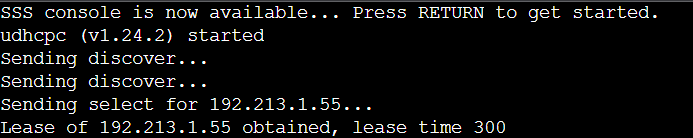
    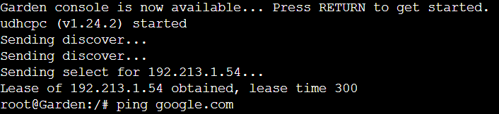

- Switch 3 (Eden, Newston, Kemono)
    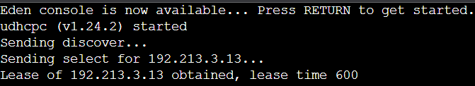
    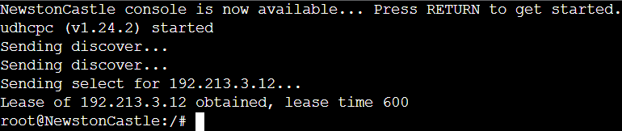
    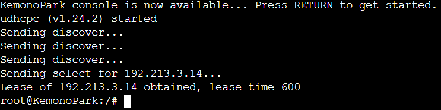

## Soal 7
Loid dan Franky berencana menjadikan Eden sebagai server untuk pertukaran informasi dengan alamat IP yang tetap dengan IP [prefix IP].3.13

### Penyelesaian 
#### Eden
1. Periksa hwaddress dari eden menggunakan `ifconfig` kemudian copy dan paste hwaddress pada `/etc/network/interfaces` menjadi sebagai berikut
    ```
    auto eth0
    iface eth0 inet dhcp
    hwaddress ether 76:2d:07:66:85:2b
    ```
2. Restart node eden

#### Westalis
3. Tambahkan konfigurasi dhcp pada `/etc/dhcp/dhcpd.conf` sehingga eden bisa mendapatkan fixed address sebagai berikut
    ```
    host Eden {
        hardware ethernet 76:2d:07:66:85:2b;
        fixed-address 192.213.3.13;
    }
    ```

4. Restart DHCP Server menggunakan command `service isc-dhcp-server restart`

### Testing


## Soal 8
Client hanya dapat mengakses internet diluar (selain) hari & jam kerja (senin-jumat 08.00 - 17.00) dan hari libur (dapat mengakses 24 jam penuh)

### Penyelesaian
Buat file baru bernama acl.conf di folder squid ```nano /etc/squid/acl.conf```
<br>
Lalu tambahkan 2 baris berikut 
```
    acl WORK_HOUR time MTWHF 08:00-16:59
    acl WEEK_END time SA 00:00-23:59
```
Lalu pada ```squid.conf``` tambahkan baris berikut 
```
http_access allow WORK_HOUR_SITES WORK_HOUR
http_access allow !WORK_HOUR
http_access deny all
```
Dan konfigurasi telah selesai

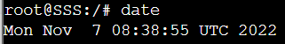
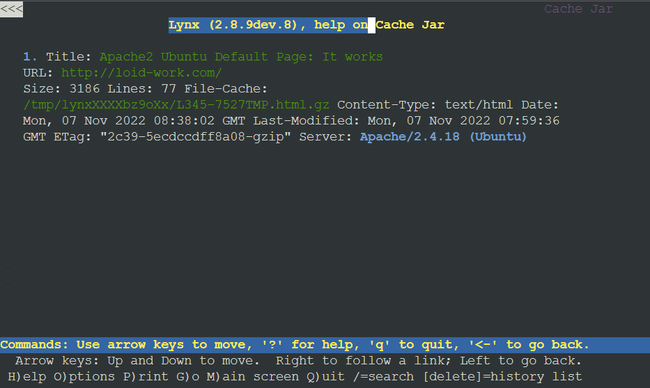

## Soal 9
Adapun pada hari dan jam kerja sesuai nomor (1), client hanya dapat mengakses domain loid-work.com dan franky-work.com (IP tujuan domain dibebaskan)

### Penyelesaian
### Wise
Masukkan konfigurasi berikut untuk mengatur nama website pada Wise sebagai DNS Server yakni pada ```/etc/bind/named.conf.local```

```
zone \"loid-work.com\" {
        type master;
        file \"/etc/bind/wise/loid-work.com\";
};
zone \"franky-work.com\" {
        type master;
        file \"/etc/bind/wise/franky-work.com\";
};
```

Lalu jangan lupa juga konfigurasi pada file masing-masing website, untuk loid pada ```/etc/bind/wise/loid-work.com```
```
;
; BIND data file for local loopback interface
;
\$TTL    604800
@       IN      SOA     loid-work.com. root.loid-work.com. (
                        2022102501      ; Serial
                         604800         ; Refresh
                          86400         ; Retry
                        2419200         ; Expire
                         604800 )       ; Negative Cache TTL
;
@               IN      NS      loid-work.com.
@               IN      A       192.213.2.2 ;IP Wise
```

Untuk franky pada ```/etc/bind/wise/franky-work.com```
```
;
; BIND data file for local loopback interface
;
\$TTL    604800
@       IN      SOA     franky-work.com. root.franky-work.com. (
                        2022102501      ; Serial
                         604800         ; Refresh
                          86400         ; Retry
                        2419200         ; Expire
                         604800 )       ; Negative Cache TTL
;
@               IN      NS      franky-work.com.
@               IN      A       192.213.2.2 ;IP Wise
```

Lalu jangan lupa kita setting Apache nya seperti berikut
<br>
Untuk loid pada ```/etc/apache2/sites-available/loid-work.com.conf```

```
<VirtualHost *:80>
        ServerAdmin webmaster@localhost
        DocumentRoot /var/www/html
        ServerName loid-work.com
 
        ErrorLog \${APACHE_LOG_DIR}/error.log
        CustomLog \${APACHE_LOG_DIR}/access.log combined
</VirtualHost>
```
Untuk franky pada ```/etc/apache2/sites-available/franky-work.com.conf```
```
<VirtualHost *:80>
        ServerAdmin webmaster@localhost
        DocumentRoot /var/www/html
        ServerName franky-work.com
 
        ErrorLog \${APACHE_LOG_DIR}/error.log
        CustomLog \${APACHE_LOG_DIR}/access.log combined
</VirtualHost>
```
### Berlint
Lakukan konfigurasi pada ```/etc/squid/working-hour-sites.acl``` masukkan baris seperti berikut
```
loid-work.com
franky-work.com
```
Dan tambahkan juga baris pada ``` /etc/squid/squid.conf ```
```
acl WORK_HOUR_SITES dstdomain \"/etc/squid/working-hour-sites.acl\"
```
Maka jika kita testing akan muncul seperti berikut :

 <br>
Untuk ```loid-work.com```

Untuk ```root.franky-work.com```
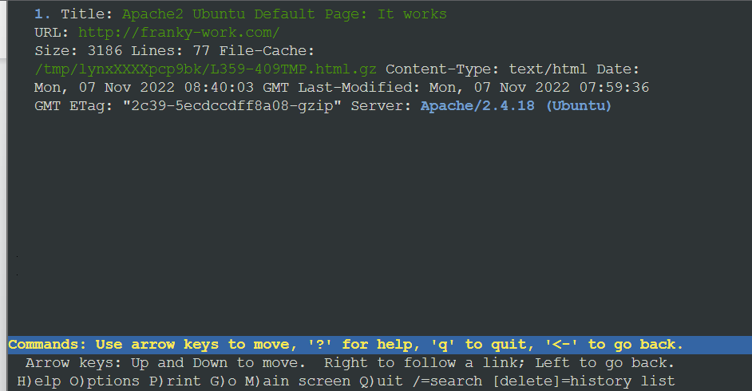

## Soal 10
Saat akses internet dibuka, client dilarang untuk mengakses web tanpa HTTPS. (Contoh web HTTP: http://example.com)

### Penyelesaian
### Berlint
Buat file konfigurasi pada ```/etc/squid/acl-port.conf``` yang berisi
```
acl HTTPS_PORT port 443
acl CONNECT method CONNECT
```
Lalu tambahkan konfigurasi pada ```squid.conf```
```
include /etc/squid/acl-port.conf

http_access deny !HTTPS_PORT
http_access deny CONNECT !HTTPS_PORT
```
<br>
Hasil Testing pada contoh web HTTP http://example.com

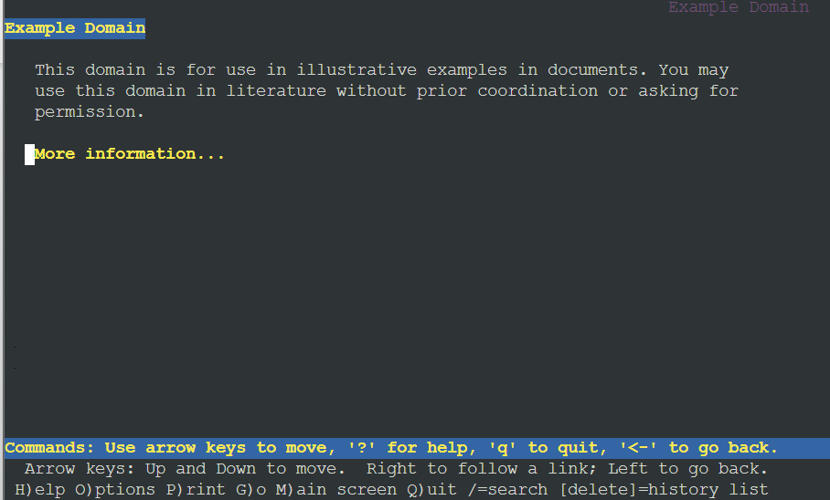
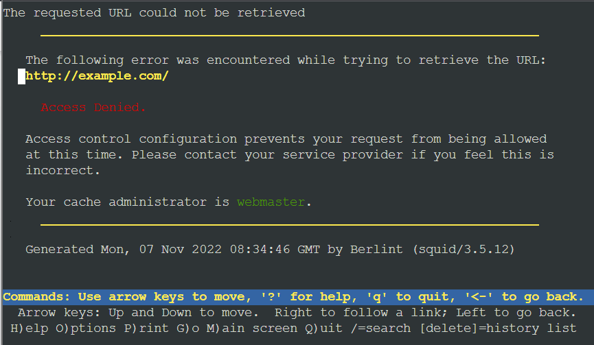

## Soal 11
Agar menghemat penggunaan, akses internet dibatasi dengan kecepatan maksimum 128 Kbps pada setiap host (Kbps = kilobit per second; lakukan pengecekan pada tiap host, ketika 2 host akses internet pada saat bersamaan, keduanya mendapatkan speed maksimal yaitu 128 Kbps)
### Penyelesaian
### Berlint

Buat script konfigurasi yang diletakkan pada ```/etc/squid/acl-bandwidth.conf ``` yang berisi seperti berikut :
```
delay_pools 1
delay_class 1 1
delay_access 1 allow WEEK_END
delay_parameters 1 16000/16000
```
Lalu tambahkan satu baris pada file konfigurasi ``` /etc/squid/squid.conf```
```
include /etc/squid/acl-bandwidth.conf
```
Lalu jangan lupa restart squid

### Testing
Pastikan speed cli telah terdownload pada node kalian

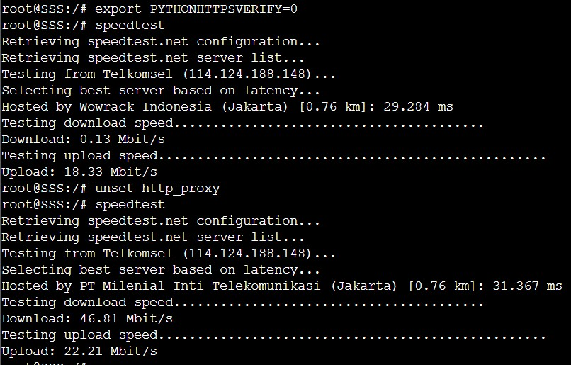
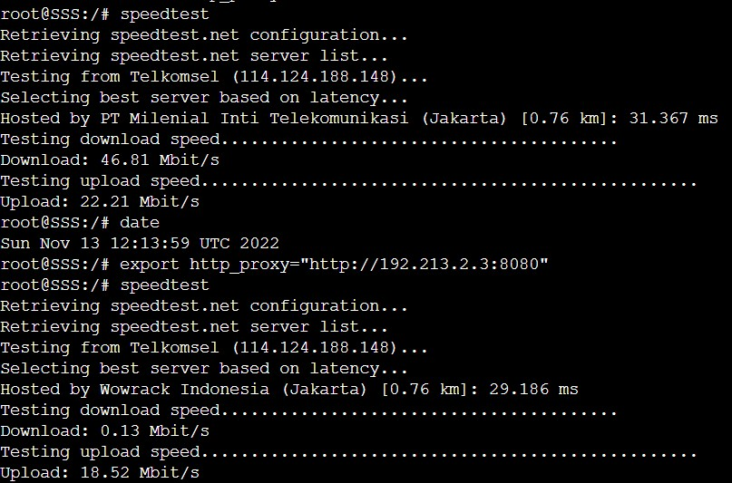

## Soal 12
Setelah diterapkan, ternyata peraturan nomor (4) mengganggu produktifitas saat hari kerja, dengan demikian pembatasan kecepatan hanya diberlakukan untuk pengaksesan internet pada hari libur


