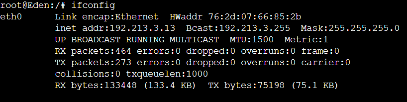

# Jarkom-Modul-3-ITA08-2022

Pengerjaan soal shift jarkom modul 3 oleh ITA08

# Anggota

| Nama                           | NRP          | 
| -------------------------------| -------------| 
| Axellino Anggoro A.              | `5027201040` | 
| Mutiara Nuraisyah Dinda R            | `5027201054` | 
| Brilianti Puspita S.  | `5027201070` |

## Soal 1 dan 2
Loid bersama Franky berencana membuat peta tersebut dengan kriteria WISE sebagai DNS Server, Westalis sebagai DHCP Server, Berlint sebagai Proxy Server , dan Ostania sebagai DHCP Relay


### Penyelesaian :
1. Buat topologi sesuai contoh pada soal sebagai berikut:


2. Konfigurasi network setiap node dan install package sesuai fungsinya:
   - WISE (DNS Server)
        ```
        auto eth0
        iface eth0 inet static
        address 192.213.2.2
        netmask 255.255.255.0
        gateway 192.213.2.1
        ```

        Karena WISE merupakan DNS Server, maka akan diinstall bind9
        ```
        echo nameserver 192.168.122.1 > /etc/resolv.conf
        apt-get update -y
        apt-get install bind9 -y
        ```

    - Westalis (DHCP Server)
        ```
        auto eth0
        iface eth0 inet static
        address 192.213.2.4
        netmask 255.255.255.0
        gateway 192.213.2.1
        ```

        Karena Westalis merupakan DHCP Server, maka akan diinstall isc-dhcp-server
        ```
        echo nameserver 192.168.122.1 > /etc/resolv.conf
        apt-get update -y
        apt-get install isc-dhcp-server -y
        ```

    - Berlint (Proxy Server)
        ```
        auto eth0
        iface eth0 inet static
        address 192.213.2.3
        netmask 255.255.255.0
        gateway 192.213.2.1
        ```

        Karena Berlint merupakan Proxy Server, maka akan diinstall squid
        ```
        echo nameserver 192.168.122.1 > /etc/resolv.conf
        apt-get update
        apt-get install squid -y
        ```

    - Ostania (DHCP Relay)
        ```
        auto eth0
        iface eth0 inet dhcp

        auto eth1
        iface eth1 inet static
            address 192.213.1.1
            netmask 255.255.255.0

        auto eth2
        iface eth2 inet static
            address 192.213.2.1
            netmask 255.255.255.0

        auto eth3
        iface eth3 inet static
            address 192.213.3.1
            netmask 255.255.255.0
        ```

        Karena Ostania merupakan DHCP Relay, maka akan diinstall dhcp server dan proxy
        ```
        echo nameserver 192.168.122.1 > /etc/resolv.conf
        apt-get update
        apt-get install isc-dhcp-server -y
        apt-get install isc-dhcp-relay -y
        ```

3. Konfigurasi lalu lintas data dari router Ostania menggunakan command `iptables -t nat -A POSTROUTING -o eth0 -j MASQUERADE -s 192.213.0.0/16`

4. Kemudian konfigurasi juga dhcp relay di **Ostania** yang terletak pada `/etc/default/isc-dhcp-relay` agar terhubung ke IP dhcp server di **Westalis** sebagai berikut:
    ```
    # Defaults for isc-dhcp-relay initscript
    # sourced by /etc/init.d/isc-dhcp-relay
    # installed at /etc/default/isc-dhcp-relay by the maintainer scripts

    #
    # This is a POSIX shell fragment
    #

    # What servers should the DHCP relay forward requests to?
    SERVERS=\"192.213.2.4\"

    # On what interfaces should the DHCP relay (dhrelay) serve DHCP requests?
    INTERFACES=\"eth1 eth2 eth3\"

    # Additional options that are passed to the DHCP relay daemon?
    OPTIONS=\"\"
    ```

## Soal 3
Semua client yang ada HARUS menggunakan konfigurasi IP dari DHCP Server. Client yang melalui Switch1 mendapatkan range IP dari [prefix IP].1.50 - [prefix IP].1.88 dan [prefix IP].1.120 - [prefix IP].1.155

### Penyelesaian
1. Agar client SSS, Garden, NewstonCastle, dan KemonoPark mendapatkan ip dari DHCP server, maka konfigurasi network tiap client sebagai berikut:
    ```
    auto eth0
    iface eth0 inet dhcp
    ```

#### Westalis
2. Kemudian konfigurasi interface dhcp server pada `/etc/default/isc-dhcp-server` sebagai berikut
   ```
    # Defaults for isc-dhcp-server initscript
    # sourced by /etc/init.d/isc-dhcp-server
    # installed at /etc/default/isc-dhcp-server by the maintainer scripts

    #
    # This is a POSIX shell fragment
    #

    # Path to dhcpd's config file (default: /etc/dhcp/dhcpd.conf).
    #DHCPD_CONF=/etc/dhcp/dhcpd.conf

    # Path to dhcpd's PID file (default: /var/run/dhcpd.pid).
    #DHCPD_PID=/var/run/dhcpd.pid

    # Additional options to start dhcpd with.
    #       Don't use options -cf or -pf here; use DHCPD_CONF/ DHCPD_PID instead
    #OPTIONS=""

    # On what interfaces should the DHCP server (dhcpd) serve DHCP requests?
    #       Separate multiple interfaces with spaces, e.g. \"eth0 eth1\".
    INTERFACES=\"eth0\"
   ```

3. Agar switch 1 yang terhubung pada client SSS dan Garden mendapat range IP sesuai soal, tambahkan konfig DHCP pada `/etc/dhcp/dhcpd.conf` sebagai berikut
   ```
    subnet 192.213.1.0 netmask 255.255.255.0 {
        range 192.213.1.50 192.213.1.88;
        range 192.213.1.120 192.213.1.155;
        option routers 192.213.1.1;
        option broadcast-address 192.213.1.255;
        option domain-name-servers 192.213.2.2;
        default-lease-time 360;
        max-lease-time 7200;
    }
   ```

4. Restart server dhcp dengan command `service isc-dhcp-server restart`

### Testing
- Client SSS
    
- Client Garden
    

## Soal 4
Client yang melalui Switch3 mendapatkan range IP dari [prefix IP].3.10 - [prefix IP].3.30 dan [prefix IP].3.60 - [prefix IP].3.85

### Penyelesaian
#### Westalis
1. Agar switch 3 yang terhubung pada client Eden, NewstonCastle, dan KemonoPark mendapat range IP sesuai soal, tambahkan konfig DHCP pada `/etc/dhcp/dhcpd.conf` sebagai berikut
    ```
    subnet 192.213.3.0 netmask 255.255.255.0 {
        range 192.213.3.10 192.213.3.30;
        range 192.213.3.60 192.213.3.85;
        option routers 192.213.3.1;
        option broadcast-address 192.213.3.255;
        option domain-name-servers 192.213.2.2;
        default-lease-time 360;
        max-lease-time 7200;
    }
    ```

2. Restart server dhcp dengan command `service isc-dhcp-server restart`

### Testing
- Eden
    
- NewstonCastle
    
- KemonoPark
    

## Soal 5
Client mendapatkan DNS dari WISE dan client dapat terhubung dengan internet melalui DNS tersebut

### Penyelesaian
#### WISE
1. 